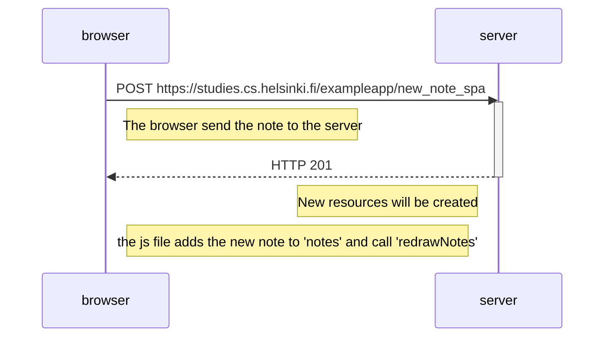

```mermaid
sequenceDiagram
    participant browser
    participant server
    
    browser->>server: POST https://studies.cs.helsinki.fi/exampleapp/new_note_spa
    activate server
    Note right of browser: The browser send the note to the server
    server-->>browser: HTTP 201
    deactivate server
    Note left of server: New resources will be created


    Note right of browser: the js file adds the new note to 'notes' and call 'redrawNotes'

```